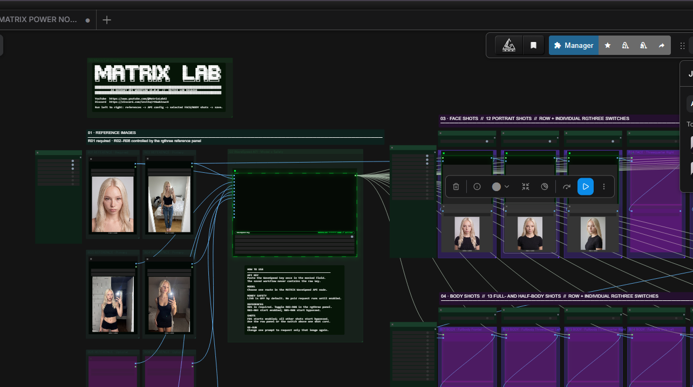

# MATRIX POWER NODES — AI Dataset

Production-oriented ComfyUI custom nodes and a ready-to-use 25-shot AI dataset workflow.
Each enabled prompt card is one independently cached API generation. Reference images keep their
original dimensions and are uploaded sequentially without native ComfyUI batching or resizing.

## Included nodes

- `MATRIX_DatasetConfig` — up to 14 native `IMAGE` references, one shared model/config output.
- `MATRIX_DatasetImage` — one prompt, one provider request, one `IMAGE` output.

The bundled workflow adds row and per-shot rgthree bypass controls. It ships with no images, no
API key, and `live=false`. Prompt cards expose only their prompt text; intentional extra paid
generations are created by duplicating a prompt card.

## Install

1. Copy or clone this repository into `ComfyUI/custom_nodes/matrix-power-nodes`.
2. Install [rgthree-comfy](https://github.com/rgthree/rgthree-comfy) for the workflow controls.
3. Restart ComfyUI and refresh the browser.
4. Load `workflows/matrix-power-nodes-ai-dataset.json`.
5. Add at least one reference image and use the `WaveSpeed Key` control once.
6. Keep `live` off while arranging or validating the graph. Enable only the shots you intend to
   purchase, then turn `live` on.

This pack has no additional pip dependencies. It uses the Python packages already owned by the
ComfyUI runtime and must not reinstall Torch, CUDA, NumPy, Pillow, or aiohttp.

For the complete beginner installation, troubleshooting, update, and uninstall instructions, use
the outer release package's `START_HERE.md`. For a zero-context coding agent, use the outer
`INSTALL_WITH_AI_AGENT.md`.

Credential entry is intentionally limited to a same-origin loopback browser. Remote, LAN,
container, and RunPod installations must provide `WAVESPEED_API_KEY` to the ComfyUI server
process instead of pasting it through the browser.

## Cost and retry safety

Every enabled prompt is a separate paid API operation. A lost submit response may already have
been billed. The pack persistently blocks the same semantic retry after an indeterminate submit.
Check the provider dashboard first; duplicate the prompt node only when you intentionally
authorize a separate paid result.

Results and reference uploads are cached per provider account without storing the credential in a
cache key. Provider keys are stored outside workflows under the current ComfyUI user directory.

## License

MIT. See [LICENSE](LICENSE).
